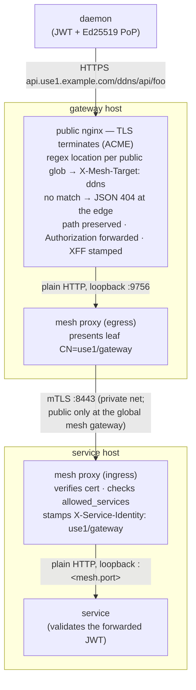
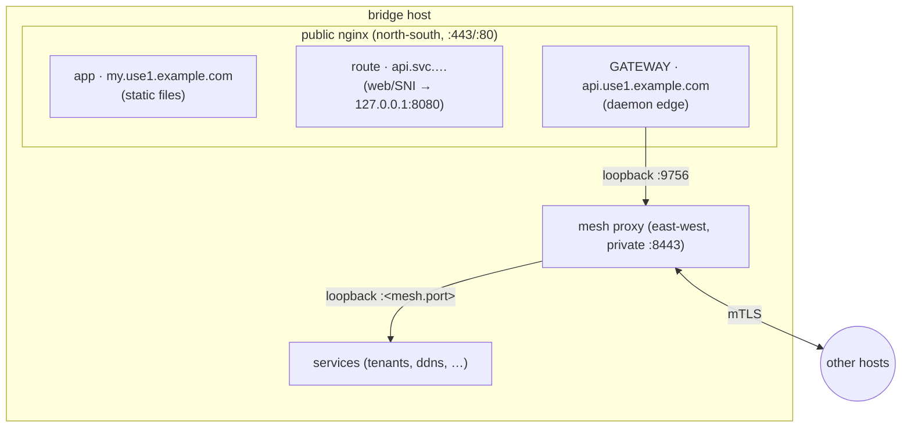
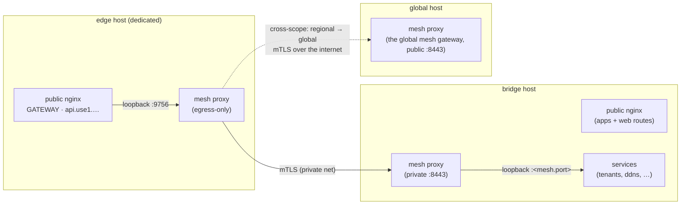

# Gateway

The **gateway** is the north-south public edge external **daemons** HTTPS into — the API front door
of an environment. It TLS-terminates the daemon connection on its own public FQDN, matches the
request path against a **derived routing table** — the gateway lists which `services:` are public;
each listed service declares *what* is public via its
[`mesh.public_paths`](./service#path-level-exposure) — and hands the request to the owning service
**through the east-west mesh** (it is a mesh client with identity `<scope>/gateway`). It holds no
service locations, does not validate the daemon's JWT (it forwards it — the service validates), and
never rewrites the request path.

It is distinct from the [ingress](./ingress) (which fronts apps and per-service web/SNI routes) and
from the mesh itself (service↔service traffic never passes through the gateway).

```yaml title="regional/gateway/api/manifest.yaml"
name: api
container: edge
host: bridge              # compute host (same scope) the gateway nginx runs on
pki: wardnet-mesh         # the mesh the gateway joins as a CLIENT (must match its listed services)
subdomain: api            # -> api.<slug>.<base> (regional) / api.<base> (global)
services:                 # the services exposed at the edge — routing is DERIVED from
  - ddns                  #   each service's mesh.public_paths (one location per glob)
  - tunneller
health_probe_paths:       # optional — edge liveness: nginx answers 200 "ok" on the 443 server
  - /livez
```

## Fields

| Field | Type | Required | Description |
|-------|------|----------|-------------|
| `name` | string | Yes | Gateway resource name (unique per scope). |
| `container` | string | Yes | Logical container/grouping, like every resource. |
| `host` | string | Yes | **Name** of the compute resource (same scope) the gateway runs on. Single-instance; the gateway reuses the host's provisioning/firewall/SSH and inherits its provider. |
| `pki` | string | Yes | Name of the **two-tier (mesh) PKI** in `pki.enc.yaml` the gateway's client leaf (`CN=<scope>/gateway`) mints from. Every listed service must declare the **same** `pki:` — a callee only trusts callers chaining to its own mesh. |
| `subdomain` | string | Yes | Public subdomain daemons connect to. The FQDN is the flat app-style form: `<subdomain>.<slug>.<base>` regional, `<subdomain>.<base>` global (an ephemeral env inserts its slug). Must not collide with an app subdomain in the scope, and must not be the reserved `ingress` label (the scope's [ingress host record](./ingress#the-ingress-dns-name)). |
| `services` | array | Yes (min 1) | The services (same scope) exposed at the internet edge. The routing table is **derived**: one nginx regex location per (listed service, [`mesh.public_paths`](./service#path-level-exposure) glob), target named in `X-Mesh-Target`. A request matching no public glob is answered at the edge with an `application/json` `404` body `{"error":"not_found"}` — it never traverses to any service. |
| `health_probes_port` | int | No | Public **plain-HTTP** port the gateway host exposes its listed services' health checks on (default `81`), demuxed by request `Host` (the service's FQDN) — the gateway twin of the ingress [health port](./ingress#health-probes). Opened to the internet only when a listed service declares its own [`health_probes_port`](./service#health-probes). Must not be `80` or `443`, and must **match** a co-hosted ingress's health port (one public health port per host). |
| `health_probe_paths` | array | No | Exact paths on the gateway's **own `443` server** that nginx answers `200 "ok"` directly — edge liveness proving the real daemon path (DNS + cert + TLS) without touching any backend. `inforge validate` rejects a path that any listed service's public glob claims. |

**A gateway is a scope singleton** — at most one per scope: it is the scope's one public daemon
edge. It may only list services in the **same scope**.

**The two sides must agree**: a listed service must include `gateway` in its
[`mesh.allowed_services`](./service#east-west-service-mesh) — otherwise the callee's mesh proxy
rejects the gateway's calls — **and** declare at least one
[`mesh.public_paths`](./service#path-level-exposure) glob (a listed service with nothing public is
meaningless); `inforge validate` rejects both up front. Public globs of **different** listed
services must not overlap — with a derived table, overlap checking is what prevents two services
claiming one path. The service name `gateway` itself is **reserved** (it is the gateway's mesh
identity).

## The request path (hops)



- **Path-preserving**: the daemon signs `/ddns/api/foo` (Ed25519 PoP covers the path); the service
  receives `/ddns/api/foo` byte-for-byte. Author `public_paths` globs against the same absolute
  paths the service serves — the gateway never strips or rewrites anything.
- **Fail-closed at the edge**: a request matching no listed service's public glob gets an
  `application/json` `404` body `{"error":"not_found"}` from the gateway nginx itself — zero
  backend traffic. An undeclared endpoint is unreachable from the internet until its path is added
  to `public_paths` and deployed.
- **JWT forwarded, not validated**: the service demuxes on `X-Service-Identity` — `<scope>/gateway`
  means daemon-originated, so it validates the forwarded `Authorization` itself.
- **WebSocket-capable** end to end (every hop passes `Upgrade` through, 1h read timeout).

## Topology shapes

The gateway's `host:` decides the shape. Both are the same three logical hops — the difference is
only whether the public nginx is shared.

### Co-located with the ingress (one host, one public nginx)

Authoring the gateway on the **same host** as an ingress merges them: apps, service routes, and the
gateway are server blocks of the **one** public nginx on that host (they share the ACME issuer and,
when a `forward` route shares `:443`, the same `ssl_preread` demux). Zero extra processes or hops —
the cheapest shape, right for small environments.



### Own host (isolated edge)

Authoring a dedicated `host:` gives the gateway its own public nginx and its own (egress-only) mesh
proxy. The daemon edge is isolated from the app/web tier — a compromise or overload of one does not
touch the other — at the cost of one more server. Traffic still crosses the same three hops; the
mesh hop just always leaves the host.



## Health

The gateway participates in the health tier on both sides:

- **Listed services' health** — when a listed service declares its own
  [`health_probes_port`](./service#health-probes) and has **no `ingress:`**, the Host-demuxed
  plain-HTTP health server renders on the **gateway's** host: the gateway exposes its
  `health_probes_port` (default `81`) publicly and reverse-proxies each probe to the right backend,
  demuxed by the service's `<svc>.svc` FQDN, exactly like the
  [ingress health tier](./ingress#health-probes). Only the service's declared
  [`health_probe_paths`](./service#health-probes) are proxied — anything else is `404`. A service
  with **both** an ingress and a gateway listing keeps its health at the **ingress** (one canonical
  health address). A listed service **co-located on the gateway host** must keep its backend
  `health_probes_port` off the gateway's public binds — the gateway's health port, `443` (daemon
  TLS), and `80` (ACME) — `inforge validate` rejects the collision.
- **The gateway's own liveness** — `health_probe_paths` on the gateway spec are exact paths the
  **`443` server itself** answers with `200 "ok"`, no backend involved. Because the probe rides the
  real daemon path (DNS resolution, the ACME cert, TLS termination), a green probe proves the edge
  end to end. A liveness path claimed by a listed service's public glob is a validation error.

## Certificates and renewal

The gateway's public cert is ACME (Let's Encrypt) on its FQDN, exactly like an app. Its **mesh
client leaf** (`CN=<scope>/gateway`, minted from its `pki:`) is delivered like every mesh leaf:
SSH-pushed into the host's `leaf.age` by `inforge deploy` (baseline) and
[`inforge pki renew`](/cli/pki), which also reload-or-restarts the mesh proxy. Nothing to run
per gateway.

## See also

- [Service — Path-level exposure](./service#path-level-exposure) (`mesh.public_paths` /
  `mesh.internal_paths` — what the derived routing table is built from)
- [Service — East-west service mesh](./service#east-west-service-mesh) (`mesh.allowed_services`,
  the `gateway` token)
- [Ingress](./ingress) (apps and web/SNI routes — the other north-south tier)
- [`inforge pki`](/cli/pki) (leaf delivery and renewal)
