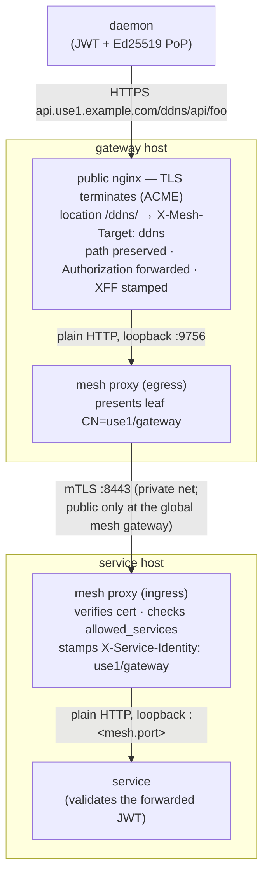
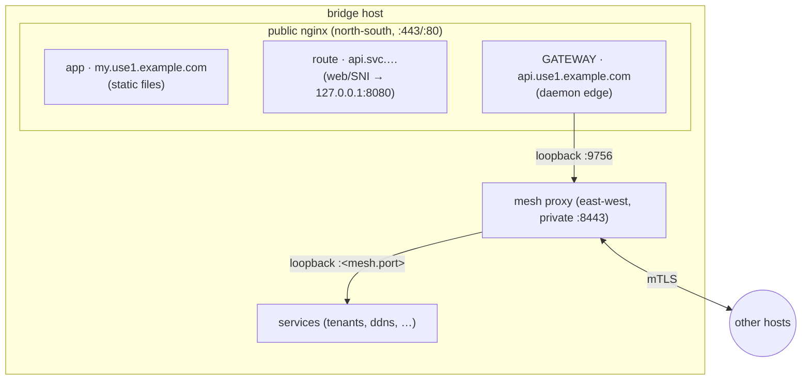
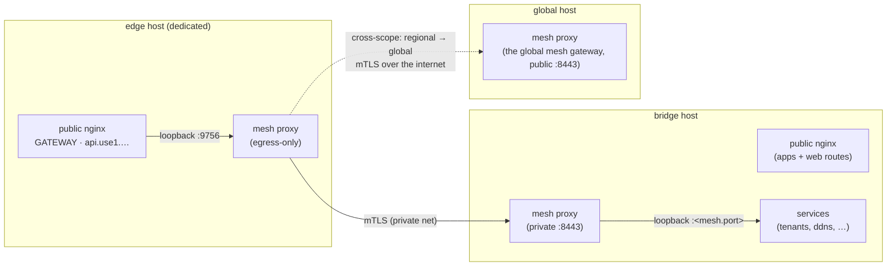

# Gateway

The **gateway** is the north-south public edge external **daemons** HTTPS into — the API front door
of an environment. It TLS-terminates the daemon connection on its own public FQDN, matches the
request path against its authored routes, and hands the request to the target service **through the
east-west mesh** (it is a mesh client with identity `<scope>/gateway`). It holds no service
locations, does not validate the daemon's JWT (it forwards it — the service validates), and never
rewrites the request path.

It is distinct from the [ingress](./ingress) (which fronts apps and per-service web/SNI routes) and
from the mesh itself (service↔service traffic never passes through the gateway).

```yaml title="regional/gateway/api/manifest.yaml"
name: api
container: edge
host: bridge              # compute host (same scope) the gateway nginx runs on
pki: wardnet-mesh         # the mesh the gateway joins as a CLIENT (must match its route targets)
subdomain: api            # -> api.<slug>.<base> (regional) / api.<base> (global)
routes:
  - { path: /ddns/,   service: ddns }
  - { path: /tunnel/, service: tunneller }
```

## Fields

| Field | Type | Required | Description |
|-------|------|----------|-------------|
| `name` | string | Yes | Gateway resource name (unique per scope). |
| `container` | string | Yes | Logical container/grouping, like every resource. |
| `host` | string | Yes | **Name** of the compute resource (same scope) the gateway runs on. Single-instance; the gateway reuses the host's provisioning/firewall/SSH and inherits its provider. |
| `pki` | string | Yes | Name of the **two-tier (mesh) PKI** in `pki.enc.yaml` the gateway's client leaf (`CN=<scope>/gateway`) mints from. Every route target service must declare the **same** `pki:` — a callee only trusts callers chaining to its own mesh. |
| `subdomain` | string | Yes | Public subdomain daemons connect to. The FQDN is the flat app-style form: `<subdomain>.<slug>.<base>` regional, `<subdomain>.<base>` global (an ephemeral env inserts its slug). Must not collide with an app subdomain in the scope. |
| `routes` | array | No | The external API surface: each entry maps a URL **path prefix** (normalized to `/<p>/`) to a target `service`, reached through the mesh. Paths are unique within the gateway; a request matching no route is `404`. |

**A gateway is a scope singleton** — at most one per scope: it is the scope's one public daemon
edge. Its routes may only target services in the **same scope**.

**The two sides must agree**: a route's target service must list `gateway` in its
[`mesh.allowed_services`](./service#east-west-service-mesh) — otherwise the callee's mesh proxy
rejects the gateway's calls, and `inforge validate` rejects the route up front. The service name
`gateway` itself is **reserved** (it is the gateway's mesh identity).

## The request path (hops)



- **Path-preserving**: the daemon signs `/ddns/api/foo` (Ed25519 PoP covers the path); the service
  receives `/ddns/api/foo` byte-for-byte. Mount daemon route groups under the route prefix — the
  gateway never strips it.
- **JWT forwarded, not validated**: the service demuxes on `X-Service-Identity` — `<scope>/gateway`
  means daemon-originated, so it validates the forwarded `Authorization` itself.
- **WebSocket-capable** end to end (every hop passes `Upgrade` through, 1h read timeout).

## Topology shapes

The gateway's `host:` decides the shape. Both are the same three logical hops — the difference is
only whether the public nginx is shared.

### Co-located with the ingress (one host, one public nginx)

Authoring the gateway on the **same host** as an ingress merges them: apps, service routes, and the
gateway are server blocks of the **one** public nginx on that host (they share the ACME issuer and,
when a `forward` route shares `:443`, the same `ssl_preread` demux). Zero extra processes or hops —
the cheapest shape, right for small environments.



### Own host (isolated edge)

Authoring a dedicated `host:` gives the gateway its own public nginx and its own (egress-only) mesh
proxy. The daemon edge is isolated from the app/web tier — a compromise or overload of one does not
touch the other — at the cost of one more server. Traffic still crosses the same three hops; the
mesh hop just always leaves the host.



## Certificates and renewal

The gateway's public cert is ACME (Let's Encrypt) on its FQDN, exactly like an app. Its **mesh
client leaf** (`CN=<scope>/gateway`, minted from its `pki:`) is delivered like every mesh leaf:
written to the host's path in the mesh workspace by `inforge deploy` (baseline) and
[`inforge pki renew`](/cli/pki), pulled by the host's `wardnet-mesh-renew` timer. Nothing to run
per gateway.

## See also

- [Service — East-west service mesh](./service#east-west-service-mesh) (`mesh.allowed_services`,
  the `gateway` token)
- [Ingress](./ingress) (apps and web/SNI routes — the other north-south tier)
- [`inforge pki`](/cli/pki) (leaf delivery and renewal)
