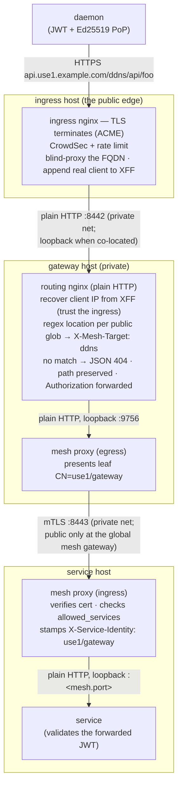
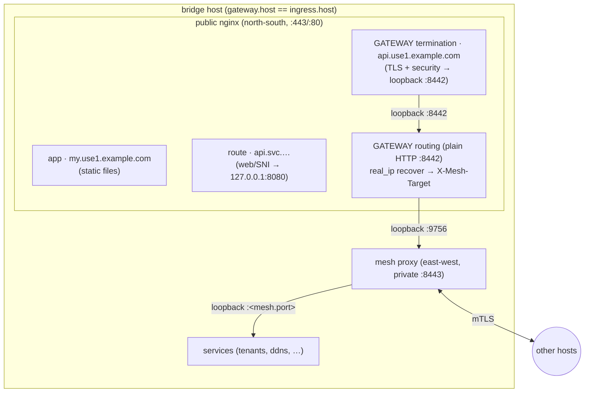
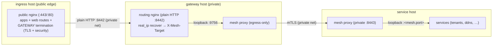

# Gateway

The **gateway** is the north-south API front door for external **daemons** — but it is **private**,
fronted by an [ingress](./ingress) (ADR-0045). A daemon connects to the gateway's public FQDN, which
resolves to the **ingress host**; the ingress TLS-terminates, enforces the edge
[security tier](/configuration/variables-yaml#security) (CrowdSec + rate limiting), and reverse-proxies
to the gateway over the private network, preserving the client IP. The gateway itself opens **no
public port** and holds **no ACME cert**. It matches the request path against a **derived routing
table** — the gateway lists which `services:` are public; each listed service declares *what* is
public via its [`mesh.public_paths`](./service#path-level-exposure) — and hands the request to the
owning service **through the east-west mesh** (it is a mesh client with identity `<scope>/gateway`).
It holds no service locations, does not validate the daemon's JWT (it forwards it — the service
validates), and never rewrites the request path.

Because a gateway is never a public edge, the security tier applies at its **ingress**, not on the
gateway host. It is distinct from the mesh itself (service↔service traffic never passes through the
gateway).

```yaml title="regional/gateway/api/manifest.yaml"
name: api
container: edge
host: bridge              # compute host (same scope) the gateway routing nginx runs on
ingress: web              # REQUIRED — the ingress (same scope) that fronts this gateway (ADR-0045);
                          #   it terminates TLS + security and reverse-proxies here. host and the
                          #   ingress's host must share a network.
pki: wardnet-mesh         # the mesh the gateway joins as a CLIENT (must match its listed services)
subdomain: api            # -> api.<slug>.<base> (regional) / api.<base> (global); resolves to the ingress host
services:                 # the services exposed at the edge — routing is DERIVED from
  - ddns                  #   each service's mesh.public_paths (one location per glob)
  - tunneller
health_probe_paths:       # optional — edge liveness: nginx answers 200 "ok" (reached through the ingress)
  - /livez
# security: false         # optional — opt this gateway's traffic out of rate limiting at the ingress
```

## Fields

| Field | Type | Required | Description |
|-------|------|----------|-------------|
| `name` | string | Yes | Gateway resource name (unique per scope). |
| `container` | string | Yes | Logical container/grouping, like every resource. |
| `host` | string | Yes | **Name** of the compute resource (same scope) the gateway's plain-HTTP routing nginx runs on. Single-instance; the gateway reuses the host's provisioning/firewall/SSH and inherits its provider. It opens no public port — its routing server is reached only through the fronting ingress. |
| `ingress` | string | **Yes** | **Name** of the [ingress](./ingress) (same scope) that fronts this gateway (ADR-0045). Required — a gateway is never publicly exposed: the ingress terminates TLS and the security tier and reverse-proxies the gateway FQDN here over the private network, preserving the client IP. This gateway's `host` and the ingress's host must **share a network** (co-located is the trivial case). |
| `pki` | string | Yes | Name of the **two-tier (mesh) PKI** in `pki.enc.yaml` the gateway's client leaf (`CN=<scope>/gateway`) mints from. Every listed service must declare the **same** `pki:` — a callee only trusts callers chaining to its own mesh. |
| `subdomain` | string | Yes | Public subdomain daemons connect to. The FQDN is the flat app-style form: `<subdomain>.<slug>.<base>` regional, `<subdomain>.<base>` global (an ephemeral env inserts its slug). Must not collide with an app subdomain in the scope, and must not be the reserved `ingress` label (the scope's [ingress host record](./ingress#the-ingress-dns-name)). |
| `services` | array | Yes (min 1) | The services (same scope) exposed at the internet edge. The routing table is **derived**: one nginx regex location per (listed service, [`mesh.public_paths`](./service#path-level-exposure) glob), target named in `X-Mesh-Target`. A request matching no public glob is answered at the edge with an `application/json` `404` body `{"error":"not_found"}` — it never traverses to any service. |
| `health_probes_port` | int | No | Public **plain-HTTP** port the listed services' health checks are exposed on (default `81`), demuxed by request `Host` (the service's FQDN). Because the gateway is private, this listener renders on the **fronting ingress host** (ADR-0045), not the gateway host. Opened only when a listed service declares its own [`health_probes_port`](./service#health-probes). Must not be `80` or `443`, and must **match** the fronting ingress's health port (one public health port per host). |
| `health_probe_paths` | array | No | Exact paths the gateway answers `200 "ok"` directly — edge liveness over the real public path (reached **through the ingress**), proving DNS + cert + termination + the gateway routing server without touching any backend. `inforge validate` rejects a path that any listed service's public glob claims. |
| `security` | bool | No | Set `false` to opt this gateway's traffic out of the env-level [security tier](/configuration/variables-yaml#security)'s rate limiting at the fronting ingress. A gateway is never a public edge, so this no longer affects CrowdSec. Absent/`true` = the env policy applies. Health-probe locations are never rate-limited regardless. |

**A gateway is a scope singleton** — at most one per scope: it is the scope's one daemon API front
door. It may only list services in the **same scope**, and must be fronted by the scope's ingress.

**The two sides must agree**: a listed service must include `gateway` in its
[`mesh.allowed_services`](./service#east-west-service-mesh) — otherwise the callee's mesh proxy
rejects the gateway's calls — **and** declare at least one
[`mesh.public_paths`](./service#path-level-exposure) glob (a listed service with nothing public is
meaningless); `inforge validate` rejects both up front. Public globs of **different** listed
services must not overlap — with a derived table, overlap checking is what prevents two services
claiming one path. The service name `gateway` itself is **reserved** (it is the gateway's mesh
identity).

## The request path (hops)



- **Private gateway**: the FQDN resolves to the **ingress host**, which terminates TLS and the
  security tier and reverse-proxies to the gateway. The gateway opens no public port; the client IP
  is recovered from the ingress-stamped `X-Forwarded-For` (trusting only the ingress, so a
  client-forged entry is stripped) — the service still sees the real daemon IP.
- **Path-preserving**: the daemon signs `/ddns/api/foo` (Ed25519 PoP covers the path); the service
  receives `/ddns/api/foo` byte-for-byte. Author `public_paths` globs against the same absolute
  paths the service serves — neither the ingress nor the gateway strips or rewrites anything.
- **Fail-closed at the edge**: a request matching no listed service's public glob gets an
  `application/json` `404` body `{"error":"not_found"}` from the gateway nginx itself — zero
  backend traffic. An undeclared endpoint is unreachable from the internet until its path is added
  to `public_paths` and deployed.
- **JWT forwarded, not validated**: the service demuxes on `X-Service-Identity` — `<scope>/gateway`
  means daemon-originated, so it validates the forwarded `Authorization` itself.
- **WebSocket-capable** end to end (every hop passes `Upgrade` through, 1h read timeout).

## Topology shapes

Whether the gateway shares its ingress's host decides the shape. Either way the gateway is private
and the ingress is the public edge — the difference is only whether the ingress→gateway hop is
loopback or crosses the private network.

### Co-located with the ingress (one host, one nginx)

Authoring the gateway on the **same host** as its ingress renders both halves on the **one** public
nginx there: apps, service routes, the gateway's TLS **termination** server (which blind-proxies over
loopback to the gateway's plain-HTTP **routing** server), and the routing server itself. Zero extra
servers — the cheapest shape, right for small environments. The gateway is still private: it never
gets a public listener of its own; only the ingress's `:443`/`:80` are public.



### Split (gateway on its own private host)

Authoring the gateway on a **different host** from its ingress (same network) isolates the daemon
routing tier: the ingress host stays the sole public edge (it runs the gateway's termination server),
while the gateway host is **private** — it runs only the plain-HTTP routing server (reached over the
network on `:8442`, opened to the network CIDR by the firewall) and its own egress-only mesh proxy.
A compromise or overload of the app/web tier does not touch the daemon tier, at the cost of one more
server. The client IP survives the extra hop via the ingress-stamped XFF the routing server recovers.



## Health

The gateway participates in the health tier on both sides — but because the gateway is private, the
public listeners render on the **fronting ingress host** (ADR-0045):

- **Listed services' health** — when a listed service declares its own
  [`health_probes_port`](./service#health-probes) and has **no `ingress:`**, the Host-demuxed
  plain-HTTP health server renders on the gateway's **fronting ingress host**: it exposes the
  `health_probes_port` (default `81`) publicly and reverse-proxies each probe to the right backend,
  demuxed by the service's `<svc>.svc` FQDN, exactly like the
  [ingress health tier](./ingress#health-probes). Only the service's declared
  [`health_probe_paths`](./service#health-probes) are proxied — anything else is `404`. A service
  with **both** an ingress and a gateway listing keeps its health at that ingress (one canonical
  health address). The health port must **match** the fronting ingress's health port (one public
  health listener per host); `inforge validate` rejects a mismatch or a collision with a route port.
- **The gateway's own liveness** — `health_probe_paths` on the gateway spec are exact paths the
  gateway's **routing server** answers with `200 "ok"`, no backend involved, reached **through the
  ingress** over the real public path. Because the probe rides DNS resolution → the ACME cert on the
  ingress → TLS termination → the private hop → the routing server, a green probe proves the edge end
  to end. A liveness path claimed by a listed service's public glob is a validation error.

## Certificates and renewal

The gateway's public cert is ACME (Let's Encrypt) on its FQDN, issued and held by the **fronting
ingress** (which terminates its TLS) — the gateway itself has no cert. Its **mesh client leaf**
(`CN=<scope>/gateway`, minted from its `pki:`) is delivered like every mesh leaf: SSH-pushed into the
gateway host's `leaf.age` by `inforge deploy` (baseline) and [`inforge pki renew`](/cli/pki), which
also reload-or-restarts the mesh proxy. Nothing to run per gateway.

## See also

- [Service — Path-level exposure](./service#path-level-exposure) (`mesh.public_paths` /
  `mesh.internal_paths` — what the derived routing table is built from)
- [Service — East-west service mesh](./service#east-west-service-mesh) (`mesh.allowed_services`,
  the `gateway` token)
- [Ingress](./ingress) (apps and web/SNI routes — the other north-south tier)
- [`inforge pki`](/cli/pki) (leaf delivery and renewal)
